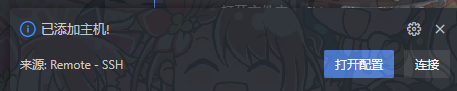
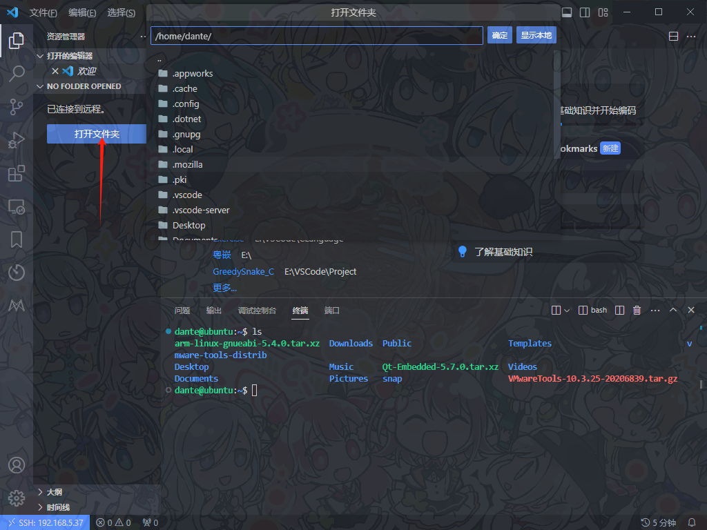

[TOC]

# Linux 疑难杂症

## 1、第一次登录Linux设置root密码

**设置root密码**

```bash
sudo passwd root
```

---

## 2、实现vscode远程连接（ssh）虚拟机（Ubuntu）

> ==注意：==
>
> 如果您的虚拟机，配置了静态网络。建议您安装一个新的网络适配器，并将其设置为NAT模式，以简化配置流程。新的网络适配器，不影响旧的网络设置 。
>
> 步骤如下：
>
> 
>
> 
>
> 
>
> 
>
> 安装成功后重启虚拟机
>
> 重启后会，找到刚刚安装的网络适配器，并将其设置为 NAT 模式
>
> 
>
> 若出现了，重启后，新的适配器不见的情况，请阅读，该手册的[第五节（5、ubuntu右上角的网络连接图标消失解决办法](#5、ubuntu右上角的网络连接图标消失解决办法)


1. 在vscode上安装下面三个插件


2. 在Linux中，打开终端，并安装 openssh-server 软件包：

```bash
sudo apt update
sudo apt install openssh-server
```

3. 安装完成后，SSH 服务将会自动运行，输入命令验证 SSH 服务是否正在运行

```bash
sudo systemctl status ssh
```

出现 active(running) 意味着服务正在运行


按`q`返回命令行。

3. Ubuntu 自带一个配置防火墙配置工具，称为 UFW。如果防火墙在你的系统上被启用，请确保打开了 SSH 端口：

```bash
sudo ufw allow ssh
```

5. 要使用 vscode 远程连接 Linux 首先要在 Linux 中安装 curl 或 wget。推荐两个都安装。

(1) 要在Linux中安装curl，您可以使用以下命令：

```bash
sudo apt-get install curl
```

如果您使用的是基于Red Hat的Linux发行版，可以尝试以下命令：

```bash
sudo yum install curl
```

这将通过包管理系统安装curl工具。

(2) 要在Linux中安装wget，您可以使用以下命令：

```bash
sudo apt-get install wget
```

如果您使用的是基于Red Hat的Linux发行版，可以尝试以下命令：

```bash
sudo yum install wget
```

这将通过包管理系统安装wget工具。

6、在vscode中设置 Remote

（1）在 vscode 中创建新的 SSH


输入 ssh your_user_name@192.168.xxx.xxx 回车


在Linux终端中使用命令查看 ip 地址 (两种命令都可以)

```bash
ip a
ifconfig
```


选择第一个


选择 连接



==注意：若出现创建连接后，跳转至扩展下载界面的情况，请按路径找到上图中红色箭头所指的文件，并删除==

在弹出的窗口中输入你的密码。该窗口会多次弹出，按要求输入密码即可。


在 终端 中输入命令 ls 显示的文件与虚拟机中的文件相同则连接成功


点击 打开文件夹 可选择你想要的目录

注意：输入密码后才可选择



==注意: 不要让你的 Linux 开启自动息屏功能,不然虚拟机有机率卡死==

---

## 3、Linux查看版本

要查看 Linux 发行版的版本信息，您可以使用以下命令之一：

- **lsb_release**：用于显示 Linux 标准基础 (LSB) 信息。
  ```
  lsb_release -a
  ```

- **cat /etc/os-release**：用于显示操作系统的信息。
  ```
  cat /etc/os-release
  ```

- **uname**：用于显示内核信息。
  ```
  uname -a
  ```

您可以选择其中一个命令来获取所需的信息。

---

## 4、Linux查看系统位数

要查看Linux系统的位数（32位还是64位），您可以使用以下命令：

```bash
getconf LONG_BIT
```

或者，您也可以使用以下命令：

```bash
uname -m
```

这将显示您的系统是32位还是64位。

---

## 5、ubuntu右上角的网络连接图标消失解决办法


**[ubuntu](https://so.csdn.net/so/search?q=ubuntu&spm=1001.2101.3001.7020)更新了几个文件后，我的ubuntu20系统右上角的网络连接图标就消失了，然后怎么也找不到了，怎么办呢？在Ubuntu22上，network-manager要替换成NetworkManager，否则会提示Failed to start network-manager.service: Unit network-manager.service not found.**

**1、按快捷键ctrl+alt+t打开终端**

**2、按以下顺序输入如下的命令行**

ubuntu20:


```
sudo service network-manager stop
```

ubuntu22:

```
sudo service NetworkManager stop
```


```
sudo rm /var/lib/NetworkManager/NetworkManager.state
```


ubuntu20:


```
sudo service network-manager start
```

ubuntu22:

```
sudo service NetworkManager start
```


```
sudo gedit /etc/NetworkManager/NetworkManager.conf
```

在运行完上一行的命令后会弹出一个文本文件，将其中的false改成true

ubuntu20:

```
sudo service network-manager restart
```

ubuntu22:

```
sudo service NetworkManager restart
```

**3、然后你就会惊喜的发现问题解决了**

---

## 6、Ubuntu 20.04 /mnt/hgfs/下不显示共享文件夹的处理办法

### 一、解决不显示共享文件夹

- ```bash
  sudo apt-get install open-vm-tools
  ```

- ```bash
  sudo vmhgfs-fuse .host:/ /mnt/hgfs
  ```

- 但重启之后会失效，需要重新执行`vmhgfs-fuse .host:/ /mnt/hgfs`

### 二、解决重启后共享文件夹失效

- ```bash
  sudo vim /etc/fstab
  ```

- 在最后添加一行：
- ```bash
  .host:/ /mnt/hgfs fuse.vmhgfs-fuse allow_other 0 0
  ```

- 以后重启都会自动挂载。

---

## 7、Ubuntu20.04更新snap-store。更新正在运行的程序。

> 1.*打开终端，输入：*
>
> *sudo snap refresh snap-store*

​    *输入密码后，大概率会出现错误，显示cannot refresh...，并且显示snap-store正在运行进程，pids:1803(或者其他数字)，这是因为snap-store无法自己更新，解决方法:* 

> *2.**需要杀死正在运行的进程：（其中这个数字是你终端显示的正在运行的进程，每个人的不一样）*
>
> *kill 1803* 

> *3.**随后再输一遍*
>
> *sudo snap refresh snap-store* 

---

## 8、vsode远程连接（ssh）linux，在vscode的中调试

因为[VS](https://so.csdn.net/so/search?q=VS&spm=1001.2101.3001.7020) code中是在终端Terminal中进行调试，可能会出现FileNotFoundError问题，需要点击Run—>Add Configurations，打开launch.json中进行修改：增加一句`"cwd": "${workspaceFolder}/src"`，workspaceFolder打开的projects的根目录，后面添加自己所需的子路径，自己调整到不报错即可

```json
"cwd": "${fileDirname}", // windosw 下的调试文件的位置
"cwd": "${workspaceFolder}/src", // Linux 下调试文件的位置
```

---

